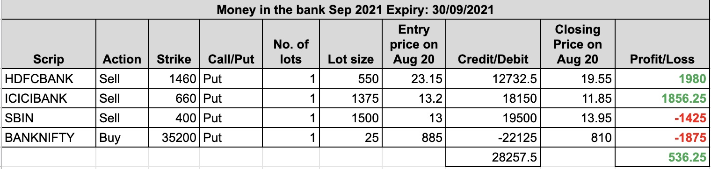

### Aug 20, 2021
We inititated our Sep 2021 series on Friday, Aug 20, 2021 at around 11:08 AM. Banknifty was trading at around 35000, HDFCBANK at 1502, ICICIBANK at 678, and SBIN at 409.
So we sold 1 lot of 2-3% away OTM puts for three banks, and to hedge them, we bought 1 lot of near ATM Banknifty Put. Following shows the trades taken.

We have total credit of Rs. 28257.50. At the end of the day, here was the situation:

Let's see what Monday brings us.
