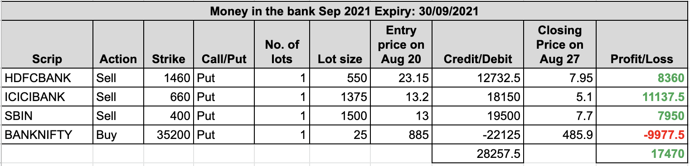

### Aug 31, 2021
A really choppy day for BNF. It went all over the place (probably doing SL hunting) and ended with 76 points gain (0.21%) to close at 36424. The three banking stocks were leaders having gains of 0.84% (HDFCBANK), 0.76% (ICICIBANK), and 0.79% (SBIN) to close at 1581.40, 719.05 and 426.05 respectively. Although BNF moved up, our bought put actually gained some price due to massive 9.01% increase in India Vix (which came due to Nifty breaking 17k barrier, and moving into unchartered territory). Our current MTM profit stands at Rs. 6508.75. We still keep our trades as it is and wait for profit to cross Rs. 9k before booking it.

### Aug 30, 2021
Sometimes Mondays are dark, but this Monday brought sunshine to BNF and its stocks. After opening 150 points gap-up, BNF went *up up up*, and finally gained 2.02% to close at 36347.65. Our 3 stocks also had party and gained 1.28% (HDFCBANK), 1.99% (ICICIBANK), and 2.49% (SBIN) to close at 1568.25, 713.65 and 422.7 respectively. It was just a matter of time that our MTM profit crossed Rs. 20k, and we closed our first set of Sepember 2021 series with profit of Rs. 20640 at around 12 noon. 

We immediately created our second set then. At that time, BNF was trading around 36000. Below is our second set created. Our initial credit is Rs. 12501.25. Let's see whether we get it or lose.

---

### Aug 27, 2021
The BNF opened on massive bearish sentiments dropping by almost 300 points, making a low of 35359.25, but then market came again to its senses and closed at 35627.80, just *10 points gain in whole day*. HDFCBANK closed 6 points lower (at 1548.45) from the previous day's close, while ICICIBANK and SBIN gaining just marginally at 699.75 and 412.45 respectively. Our MTM profit increased to Rs. 17470. Still, we wait for Rs. 20k profit before booking.

---

### Aug 26, 2021
Today was weekly as well as monthly expiry. Expiries recently have been rangebound and so was today. BNF made a low of 35411 for a very short time, and then mostly remained around 35700 to end with 35617.55. Two of the three stocks (HDFCBANK and SBIN) were losers, and so our MTM profit was bound to decrease. At the close of the market, HDFCBANK closed at 1554.80, ICICIBANK at 698.80, and SBIN at 410.75. Our MTM profit reduced to Rs. 14302.5.

---

### Aug 25, 2021
On Wednesday 25th Aug 2021, BNF was rangebound between 35500 and 35900. The 3 stocks also didn't do much. At the close of the market, Banknifty was at 35586, HDFCBANK at 1557.40, ICICIBANK at 691.05, and SBIN at 416.25. Our MTM profit increased by Rs. 1200 more to reach Rs. 17506 at the end of the day. We still do nothing and wait for Rs.21000 profit before booking it.

---

### Aug 24, 2021
On Tuesday 24th Aug 2021, BNF was controlled by bulls. This is the kind of rally we require in this setup. All three top stocks were gainers. At the close of the market, Banknifty was at 35712, HDFCBANK at 1558.85, ICICIBANK at 694.45, and SBIN at 417.60. At the end of the day, we have an MTM profit of Rs. 16328. We still do not book the profit and wait for at least Rs. 21000 (75% of our initial credit).

---

### Aug 23, 2021
On Monday 23rd Aug 2021, BNF had its ups and downs and ended with gain of 90 points. At the close of the market, Banknifty was at 35124, HDFCBANK at 1524.60, ICICIBANK at 682.70, and SBIN at 409.50. Our MTM profit was Rs. 6745.

---
### Aug 20, 2021
We inititated our Sep 2021 series today on Friday, Aug 20, 2021 at around 11:08 AM. Banknifty was trading at around 35000, HDFCBANK at 1502, ICICIBANK at 678, and SBIN at 409.
So we sold 1 lot of 2-3% away OTM puts for three banks, and to hedge them, we bought 1 lot of near ATM Banknifty Put. Following shows the trades taken.

We have total credit of Rs. 28257.50. At the end of the day, here was the situation:

Let's see what Monday brings us.
