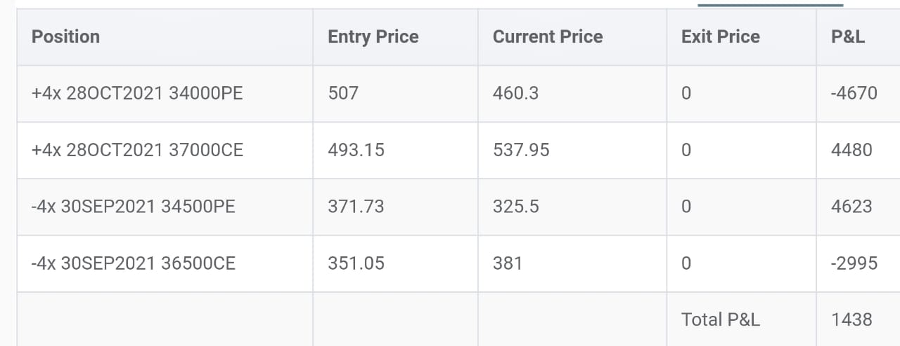
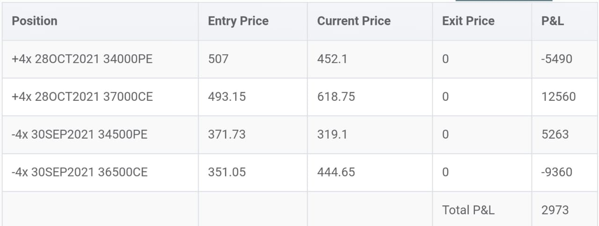
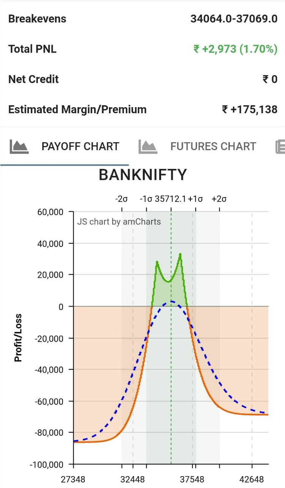

### Aug 30, 2021
Today we had to adjust the trades, and not just one leg, but both the legs. The idea was to shift puts closer as BNF touches 36000, and keep CE as it is until it reaches 36500. But boy, it made a high of 35398.45, so I decided to shift calls as well. So when BNF touched 36000, I only shifted Sep34500PE to Sep35000PE (keeping everything as same). But later, I shifted Sep35000PE to Sep35500PE, and also shifted Oct34000PE to Oct34500PE. On call side, we shifted Sep36500CE to Sep37000CE and Oct37000CE to Oct38000CE. Due to this shifting, and slippages (yes there are slippages in OCT trades), we are currently in notional loss. But we stay with the trades. Now our next shifting will be only when market touches 37000 or 35800. In the payoff graph, we are again in the middle, and our goal is to keep in middle as long as we can.

### Aug 27, 2021
You don't need to do much in this strategy given such a large range between breakevens. The market remained in our prefered range, hence we just stayed with the trades and didn't do anything.

### Aug 26, 2021
BNF is moving in a range. Today BNF made a low and high of 35411 and 35785 respectively. When it crosses 36200 or 34700, then only we will shift the calendars. For now, our trades look liked this at the closing of the day.

### Aug 24, 2021
Today on Tuesday 24th Aug 2021 at 11:30 AM, we set up our double diagonal spread for september 2021 series. At that time, BNF was trading at 35450. From there, it was just Bulls who ran the market, and BNF closed at 35712.
Our trades looked like this at the closing of the day.

<!--  -->

The payoff graph looked like this.

The breakevens are still far, so we do nothing until BNF breaches 36200 on the upside.
